# Netflix Multi-Table Analysis Report

## Main recommendations

1. Expand casual non-sophisticated audience with lightweight content such as romance-related genres and comedies. Those are already very prevalent in the title database (Q5), and they also are pretty prevalent in the top-10 titles by rating (Q10) and top-5 genres by rating (Q11), so there is demand for that kind of content and the respective fanbases tend to be very dedicated. Furthermore, such content is very present in top-10 by viewership (Q14). Even though there is no clear correlation between ratings and viewership (Q17), high ratings with mediocre viewership are still profitable as that tends to mean a steady fanbase for the content. Both are common for genres like Comedy, Romance, LGBTQ, and Musicals, so it is a natural expansion direction for the movie database and for advertisement targeting.

2. Avoid expanding the database back in history by adding older titles without any filtering. The audience reaction to older titles fluctuates heavily and tends to lower with time on average (Q13), but there are distinct years with multiple well-acclaimed classics that stand out by having much higher than average rating (Q13). That is why retroactive expansion of the database only makes sense for targeted years known for being good years for movie industry, and the main aim here needs to be set on adding the recognizable, universally loved classics. 

3. While our service is growing steadily in terms of viewership (Q16), there are noticable drawdowns lasting from several months to over a year. It is logical to attribute that to weather changes and readiness of the customers not to spend time inside watching content, considering that the interval of July-September is by far the worst part of the year historically and does not fluctuate (Q16), as it is very uncommon for people to not spend time outside in that time of the year. The best periods of the year fall into the exact opposite - December and April, known for having a lot of precipitation outside (Q16). For that reason the larger, seasonal advertisiment campaigns should be avoided in Summer and later Winter, and should be mostly kept to early Sprind and later Fall, so that they overlap with the periods of time people spend day inside, eager to watch movies or shows.

## Analysis Experiments and Results

### Movie Catalog Overview

#### Q1 - Number of titles, Movie vs TV Show split

We have twice as much Movies as TV Shows. Total titles is 800.

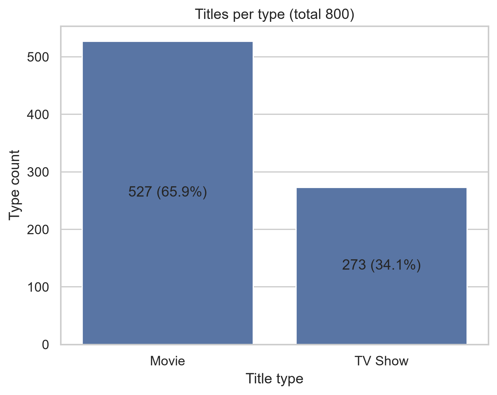

#### Q2 - Catalog growth by year

We see that the rate of titles being added to the site stays roughly uniform over the years. Also the fractions of Movies and Shows stays close to 2/1 over the entire history. The notable year here is 2020, where there are noticably more Shows than normal when compared to Movies, almost 80% of the number of Movies. It probably happened because of COVID and users having more demand for longer-form content, and it also falls right after the ending of Game of Thrones as the biggest TV Show at the time, which brought in more investors into making Shows instead of Movies.

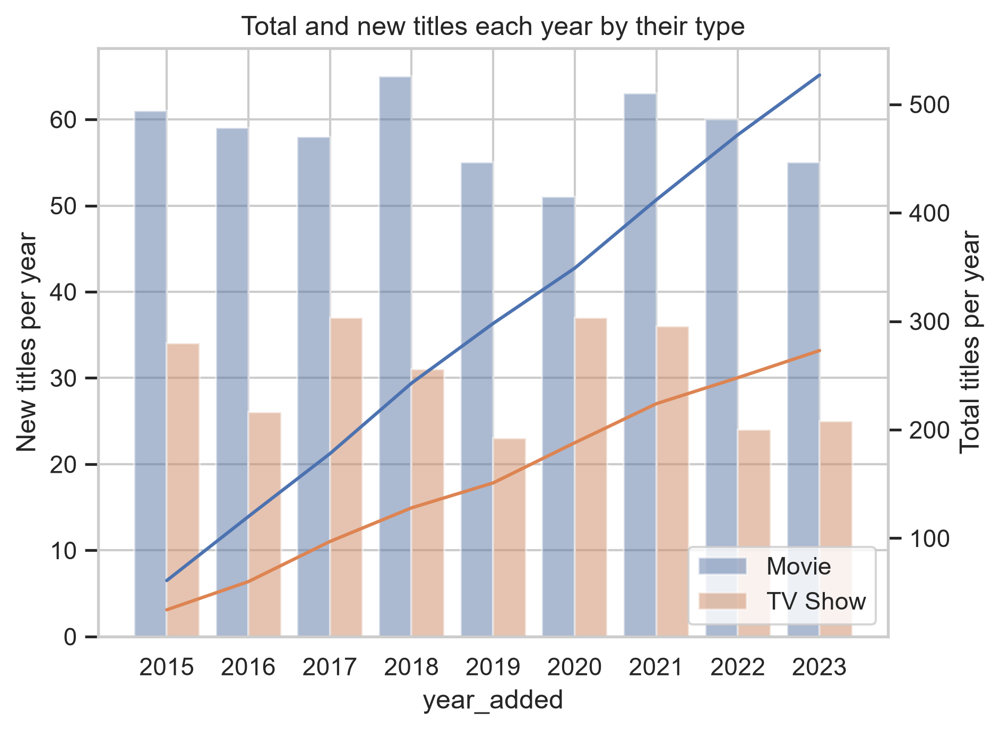

#### Q3 - Most common content ratings

The most common ratings are TV ones, with TV-PG being the most frequent. Among non-TV rating the most frequent is R, which is default for many action movies or shows. The fraction of Movies to Shows in each rating is once again very close to 2/1, with the notable exception being TV-Y7, which has a bigger share of Shows. TV-Y7 is older children above 7 years old, so it would make sense that this content rating group would contain a lot of cartoons, which are most often Shows rather than Movies.

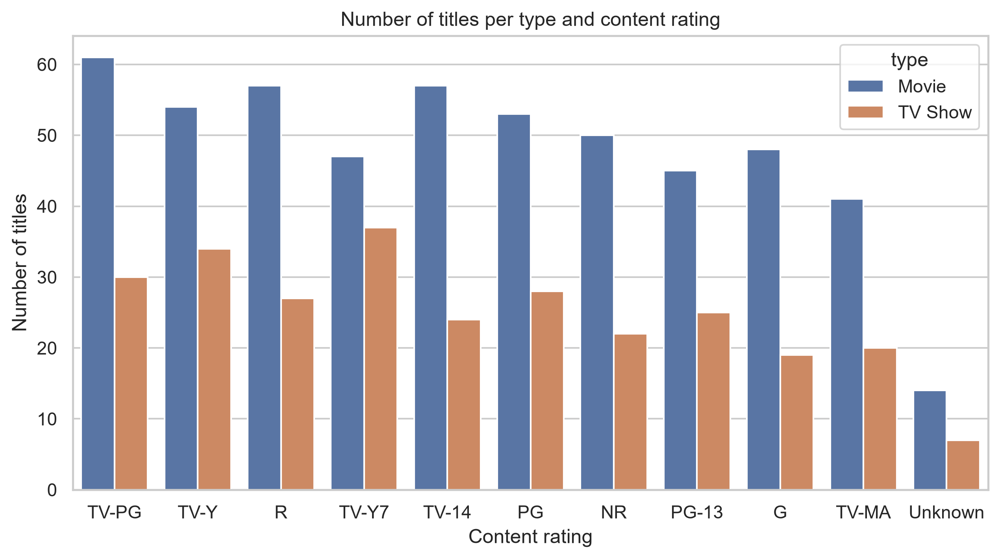

We see that the individual country-rating pairs have too few titles to have any noticable pattern. There are some per-country patterns, like e.g. South Korea noticably preferring non-TV ratings like R/NR/G, or India preferring TV-PG over PG. TV-MA, which is supposed to be a more rare alternative to R, is only common in Australia and Canada. Another intereseting thing is that many titles without country are either R or G, G here being the most default content rating (General), and R being the most common non-TV one.

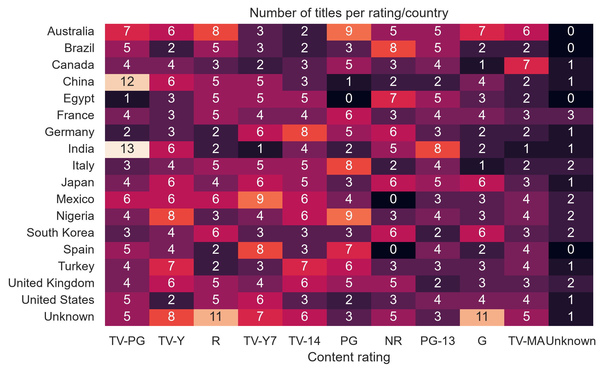

#### Q4 - Top 10 producing countries

The top-10 countries is very interesting because it is somewhat unexpected. While there are several countries here with well-known movie/show industry, like Mexico, Japan, India, China, and Italy, the US is noticably absent from the top-10. Also Australia by quite a few titles is unexpected. Interesting findings here are that China produces relatively more Shows than other country, and Japan and France relatively less. On average though the proportion between Movies and Shows is maintained here, and few countries stray far from it. One thing we can safely take away from this experiment is that there isn't a very sharp top of most-producing countries - the difference between number 2 and number 10 is just 9 titles.

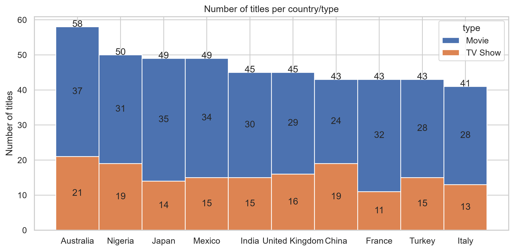

### Genres

#### Q5 - Top 10 most common genres

The genres at the very top are mostly lightweight content such as comedy or romance, with one outlier being Documentaries at number 2. Once again, just like with countries, there isn't really a sharp top, with differnce between top-1 and top-10 being just 20%. The shares of Movies and Shows here are still roughly 2 to 1, with notable exceptions in this top-10 being Documentaries, and Romantic _Movies_ having a bigger Movie share, and Comedies, Reality TV and Anime having a bigger TV Show share - all of those are pretty logical considering the nature of those genres.

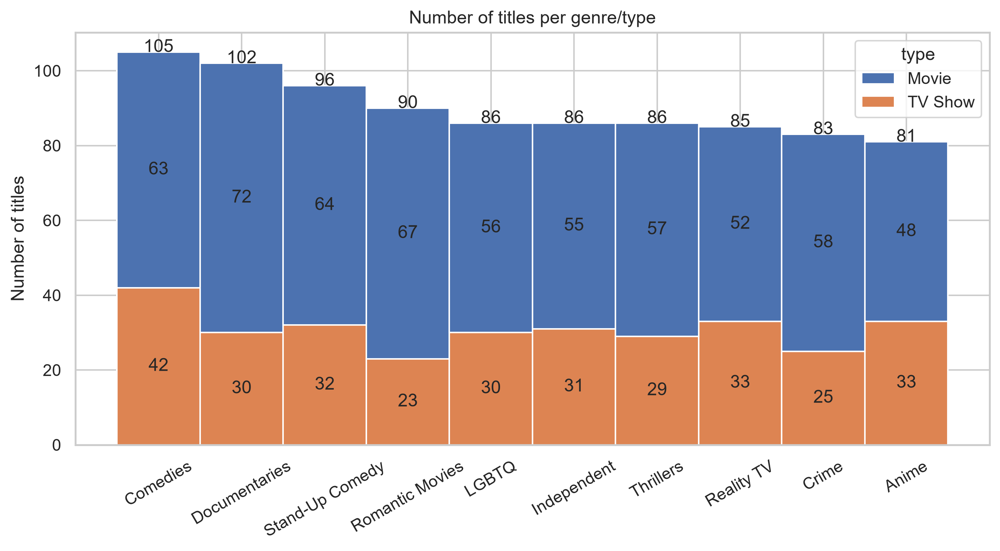

#### Q6 - Genres by type (Movie vs TV Show)

The genres with greater than average share of TV Shows are Anime (which are know for be series-based), Comedies (which probably means sitcom - also very common to be a series), and Reality TV (does not make very much sense as a movie). The genres with lower than average share of TV Shows are Crime (pretty common theme for action movies), Documentaries (while there are well-known documentary series, it is still more common to see them as movies), Musicals (very uncommon to be series-based), and Romantic Movies (Movies is literally in the genre name). Apart from those easily explainable outliers, most of the genres fall close to the average relative shares of Movies and TV Shows.

| Genre      |   Movie |   TV Show |
|:-----------|--------:|----------:|
| Anime      |      48 |        33 |
| Comedies   |      63 |        42 |
| Reality TV |      52 |        33 |

| Genre            |   Movie |   TV Show |
|:-----------------|--------:|----------:|
| Crime            |      58 |        25 |
| Documentaries    |      72 |        30 |
| Music & Musicals |      56 |        22 |
| Romantic Movies  |      67 |        23 |

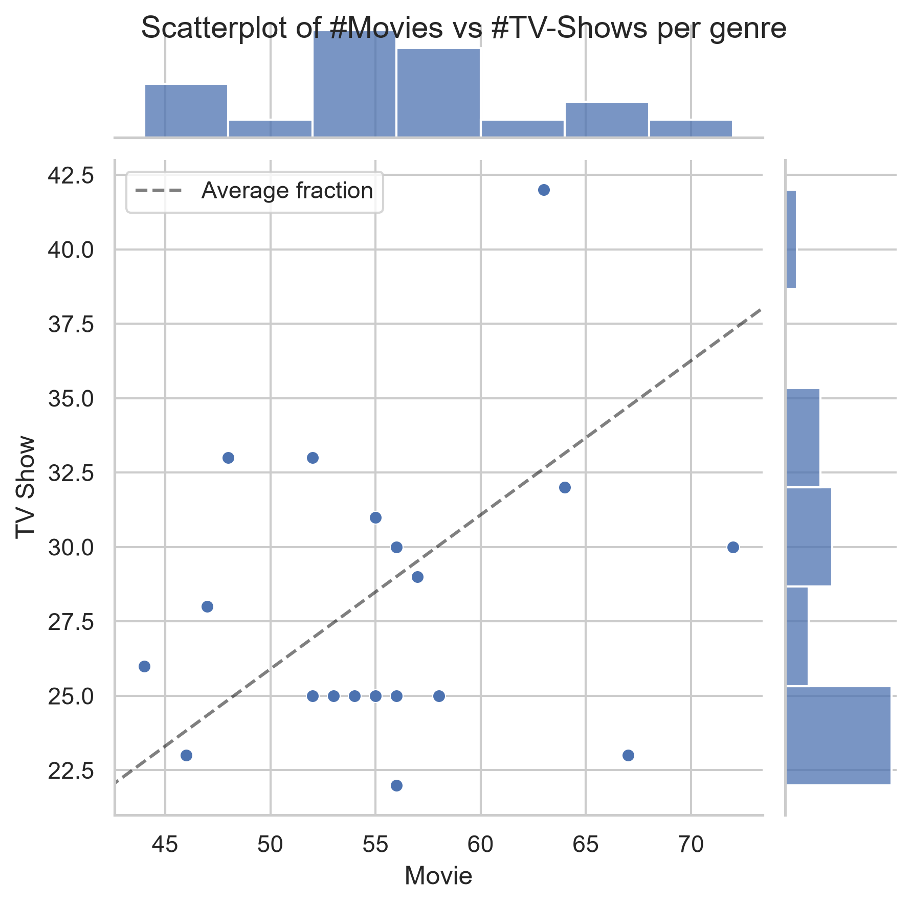

### Actors and Casting

#### Q7 - Top 10 most frequent actors

While there are well-known older actors in the top such as Penelope Cruz and Idris Elba, there are also younger ones with recent prominence in films, such as Anya Taylor-Joy and Adam Driver. The top is very uniform with difference between top-2 and top-10 being only 7 titles, and the fraction of Lead roles is also pretty close across the top-10. The only outlier is Penelope Cruz with a noticably bigger share of Lead roles and a large gap in number of titles overall.

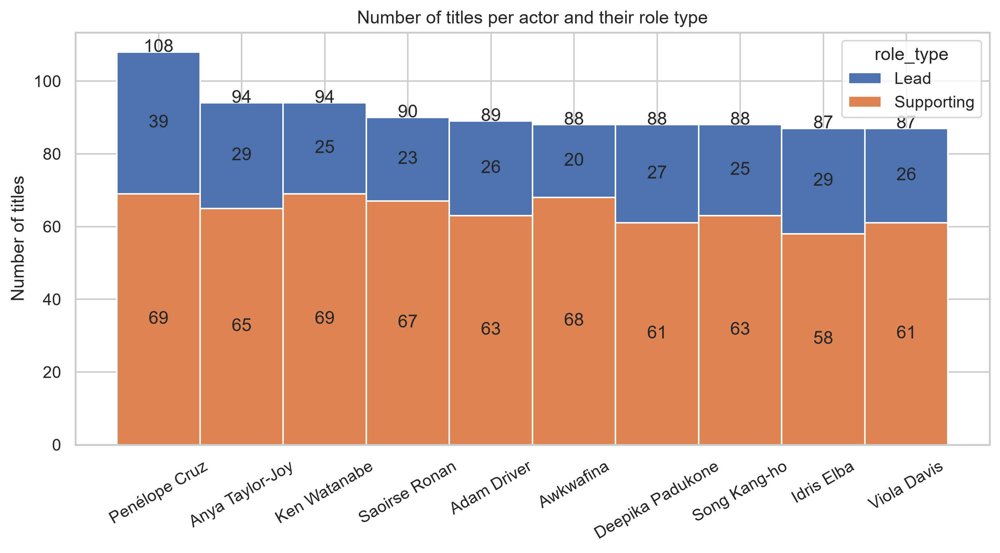

#### Q8 - Lead vs Supporting actor frequency

The actors with larger than average share of Lead roles are very well-known stars of Hollywood, with Penelope Cruz being especially far from the main actor distribution both in terms of absolute numbers of titles starred in, as well as in terms of the Lead roles share. The actors with the lowest fraction of Lead roles are still well-known, but not as universally accepted to be the top Hollywood stars, so they still appear in movies a lot, but mostly on Supporting roles.

| Actor         |   Lead |   Supporting |
|:-------------------|-------:|-------------:|
| Jason Momoa        |     24 |           39 |
| Millie Bobby Brown |     31 |           53 |
| Penélope Cruz      |     39 |           69 |
| Tom Hanks          |     29 |           47 |

| Actor    |   Lead |   Supporting |
|:--------------|-------:|-------------:|
| Awkwafina     |     20 |           68 |
| Javier Bardem |     15 |           62 |
| Meryl Streep  |     18 |           66 |

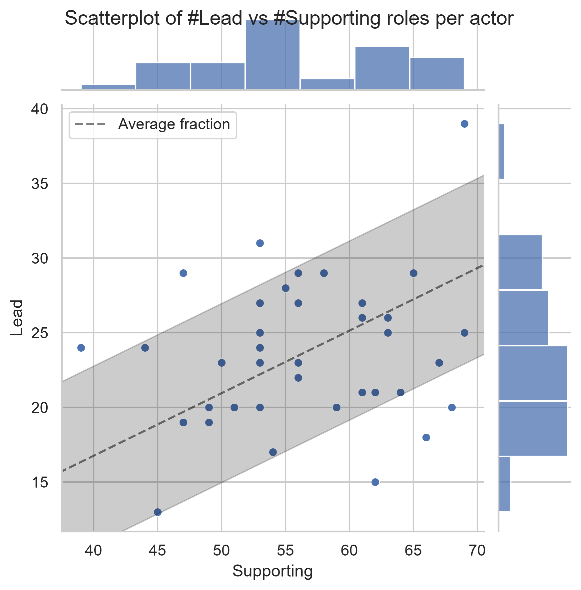

### Ratings

#### Q9 - Overall average rating across all titles

Overall average across all titles and users is 3.64, which is noticably above the real average of 3. This is a well-known skeweness across all user ratings in all industries, with users more likely to leave a rating if they liked a product than if they did not. This is also obvious by the 1 rating being by far the most rare one, and 4 (being the rating you would leave if you like the movie but still think it could be better) being the most frequent.

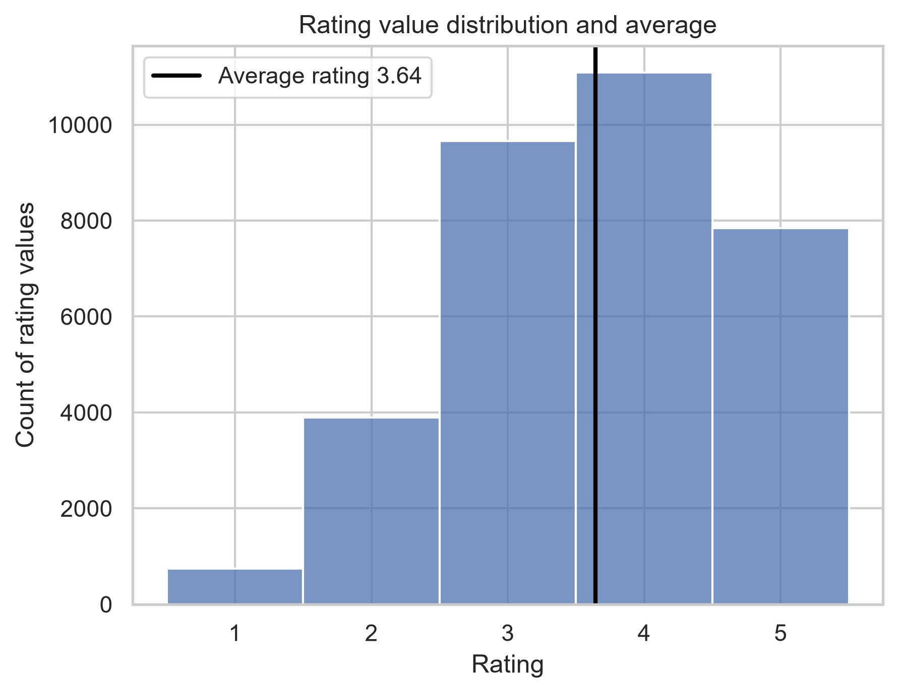

#### Q10 - Top 10 highest-rated titles

We see that the rating top is populated by niche but still-well known titles, leaning more towards indie genres such as Anime, Independent, LGBTQ, and Stand-Up Comedy. It is pretty common for the rating tops to be populated by niche titles with dedicated but isolated fanbase, as more well-known and general titles get more bad reviews from people just because they are so prominent.

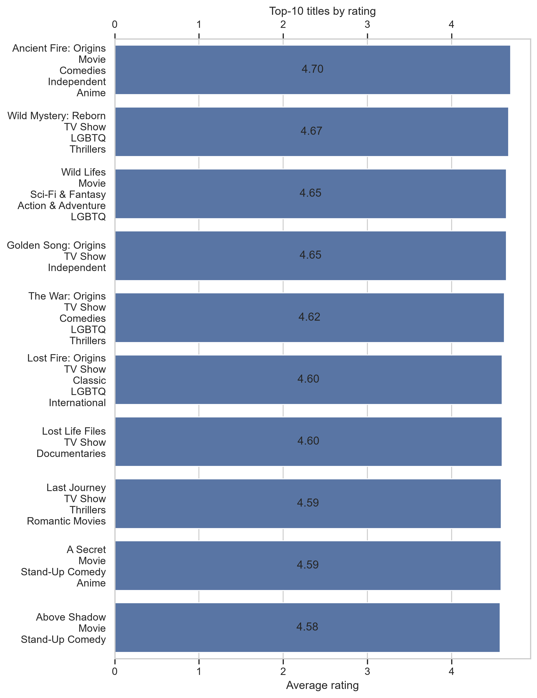

#### Q11 - Average rating per genre

We see that the ratings per genre are generally very close between the Movies and Shows of that genre, with noticable outlier being Romantic Movies, with, well, Movies rated much higher than Shows in that genre. The top-3 of genres by average rating overall is populated by romance-related genres: Dramas, LGBTQ and Romantic Movies. Top-4 and top-5 are Documentaries and Independent, which tend to get high rating as well due to dedicated audience. We could call either Dramas as the highest overall average or Romantic Movies as the highest Movie average genre the most beloved, but it makes more sense to just group all the top-3 genres into one category here - the most beloved category being romance-related titles.

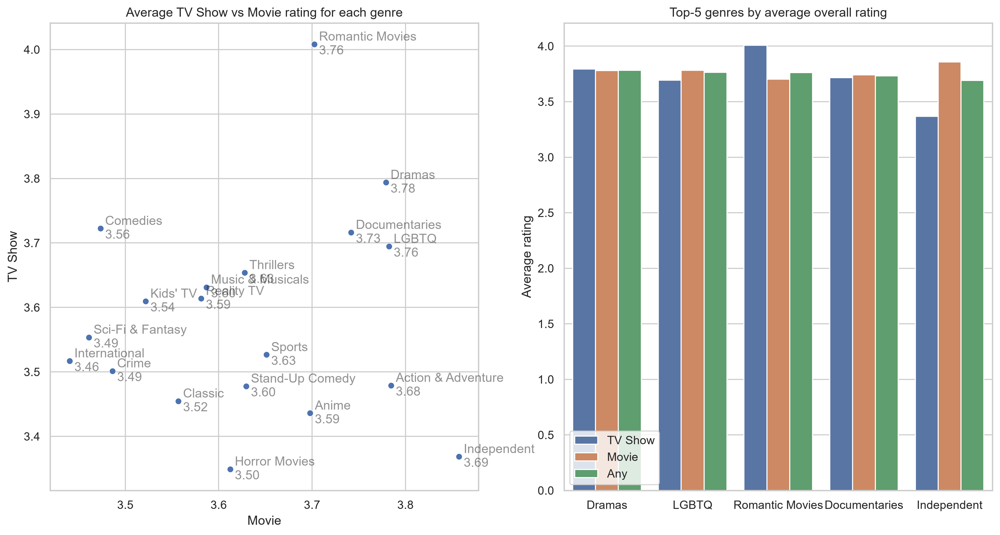

#### Q12 - Do Movies or TV Shows get higher ratings

We see that by both calculations, Movies have slightly higher rating. When aggregating across all titles before averaging, we see that Movies get 5 stars more often, while Shows get more ratings in 2-4 range. When first averaging by title, we see that Shows often get average ratings around 3, but also more often get higher ratings in the 4-4.5 ballpark, while Movie distribution is more uniform from 3 to 4.5, and has more titles with very high (>4.5) and very low (<2.5) ratings. Overall averages in both cases are very close, and I would assume especially in the second case, that the difference is not statistically significant.

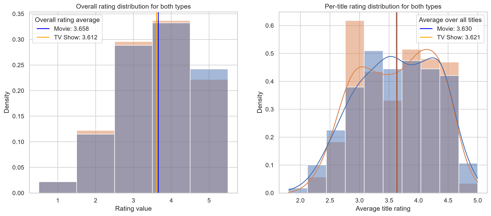

#### Q13 - Release year vs average rating

We see that average rating per year largely stays uniform with minor fluctuations and no visible trend. One interesting finding here is that there are distinct years early in the movie history we have, where average rating peaks noticably. Those might correspond to the years filled with widely-accepted classics such as Terminator 2 and Silence of the Lambs in 1991 or Matrix and Fight Club in 1999. While there is no general trend there, there are distinct years with noticably higher rating than average.

When plotted against the years since release, the rating stays very stable over the first 15 years, then starts to drop off. The peak at 20 years old likely corresponds to 1999 again, but overall the trend is clear that the older movies on average get lower ratings. The peak at over 30 years is very unstable as shown by the error bars, and should not be viewed as meaningful.

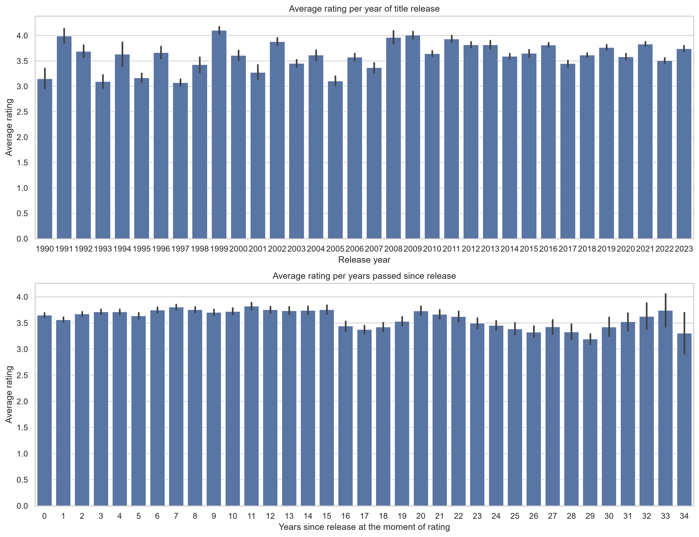

### Viewership

#### Q14 - Top 10 most-viewed titles

We see that once again the best-performing titles are the ones falling into the lighthearted, romance-related categories, such as Reality TV, Musicals, Comedies, LGBTQ, Romantic Movies, and Stand-Up Comedy. It makes sense for them to be the most viewed overall - they might not be the acclaimed well-known classics, but they are still viewed by thousands of regular people looking for a relaxed viewing experience. The only outlier in this pattern is top-9, a Sci-Fi Drama - it still kind of falls under the romance umbrella, but still Action/Sci-Fi/Drama differs noticably in tone from Musicals and Reality TV.

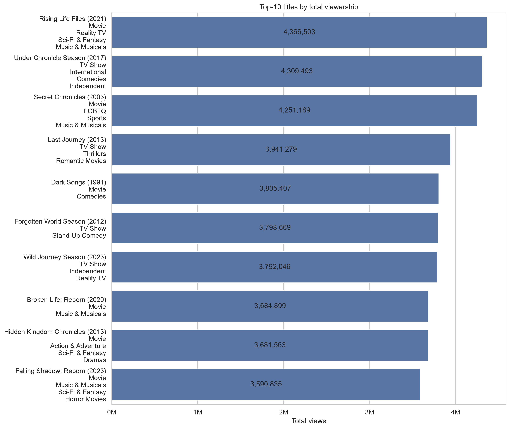

#### Q15 - Total views per genre

We see that unlike other metrics, in terms of viewership the genres differ vastly between the types of content. The biggest group by views is Sci-Fi/Fantasy, and it is still roughly 2/1 between Movies and TV Shows, but the next two of the top-3 show completely different pictures. Comedies at top-2 have more views in Shows than in Movies, probably thanks to Sitcoms, while Musicals have a vast majority of views in Movies. The lighthearted romance-related content mostly dominates the top-10, with Comedies, Musicals, Stand-Up, LGBTQ, Dramas, Reality, and Romantic Movies. The top-1 is Sci-Fi/Fantasy, thanks to very popular titles like Star Wars and Game of Thrones, and also thanks to their legacy in attracting much more investor money into the genre (see e.g. the rise in Fantasy after GoT ended at the start of the twenties).

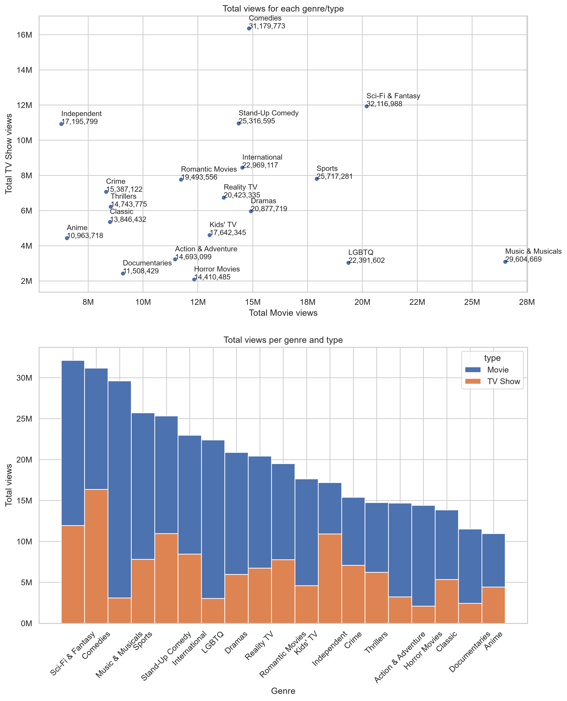

#### Q16 - Monthly viewership trend across the platform

We see that our service grows steadily from year to year, but still has drawdowns in viewership lasting 1-2 years. There is a noticable peak in viewership in many years around that year's start. On per-month average share plot we see that the two peaks are December and April, with two lowest points being February and the entirety of July-September. Also the summer low-viewership months are characterized by low variance of viewership share. Those two patterns can be explained by the weather outside affecting when people decide to engage with the service - April and December are generally worse years to be outside due to rains and snow respectively. Also, summer months are almost always sunny and inviting to go outside, while all the other seasons can have differing weather, which explains the much lower variance in summer compared to all other months.

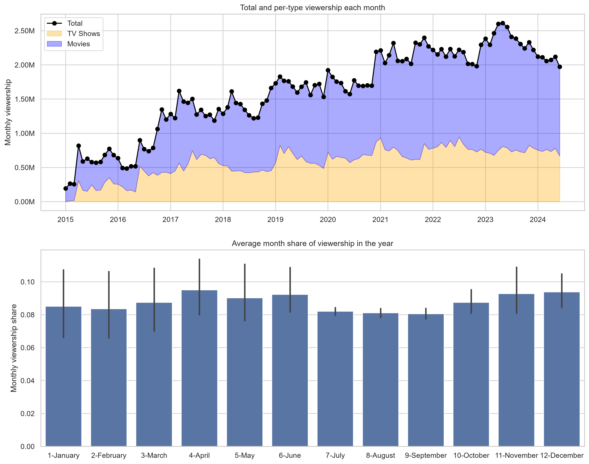

#### Q17 - Are highly-rated titles the most viewed

As we can see because of different scales of views the concrete correlation is hard to see in one plot. To get better takeaways we need to bin viewership by scale and look at each bin individually. We can see that the natural breakpoints for bins are 300, 1000, 5000 and 30000.

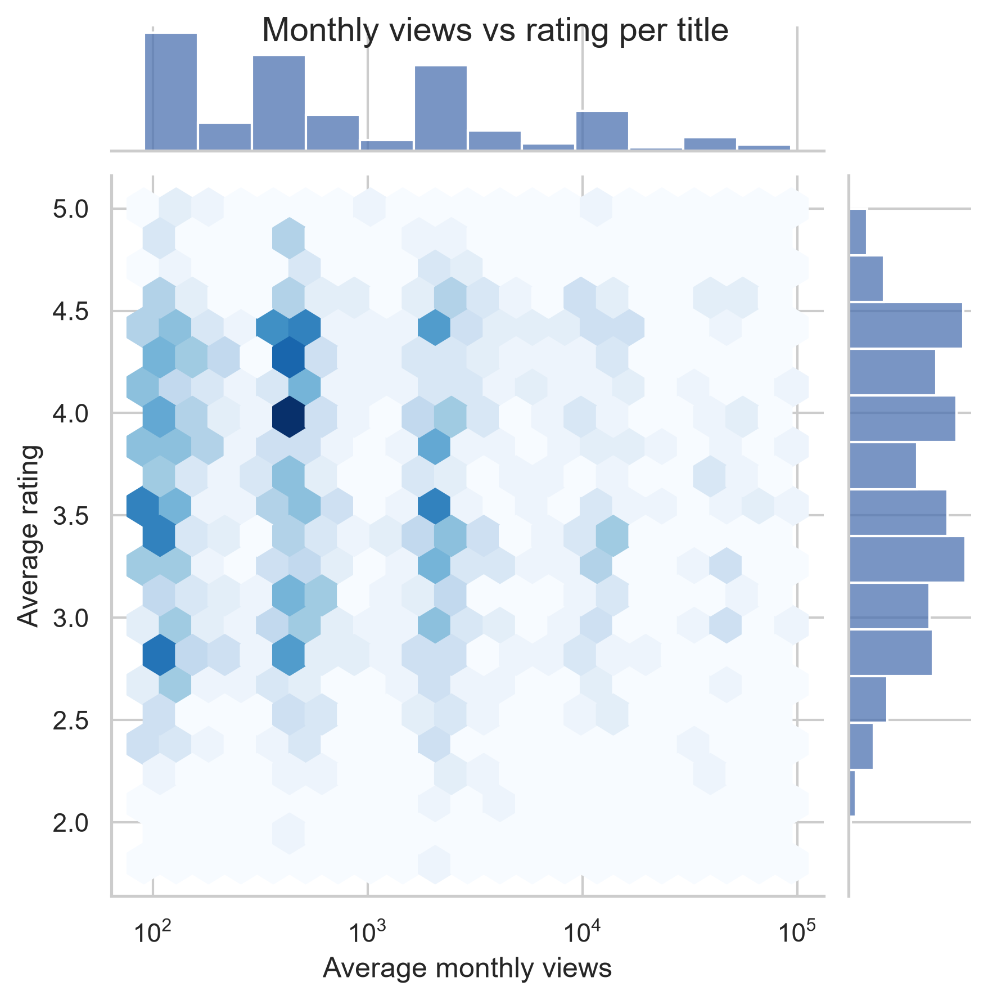

The overall correlation is negligible between views and ratings. If we bin by viewership scale, only the most-viewed titles have a positive correlation, though it still looks dubious and mostly caused by higher-thant average rated very popular titles. Otherwise in most bins except the first and the last one, the correlation turns out to be slightly negative. It is explained by the same niche-versus-mainstream phenomenon we discussed already - niche titles tend to have more dedicated audience and thus get higher ratings than more well-known titles.

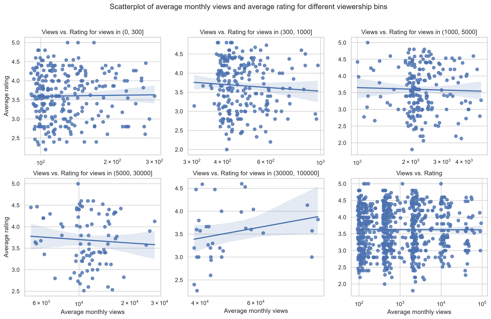